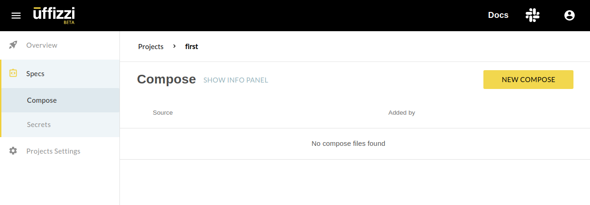
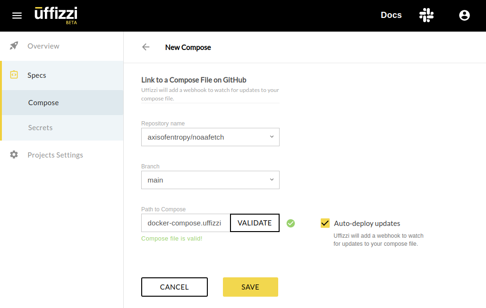
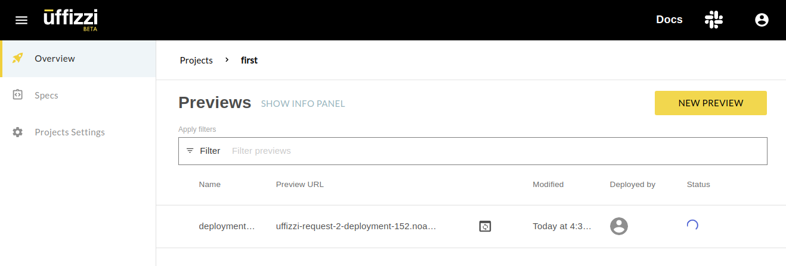

# Continuous Previews with Bring Your Own Build 

If you're looking for a Full Stack Preview capability but want to bring your own CI/CD solution and Container Registry - keep reading. In this blog I'll show how Uffizzi gives users the ability to enable tag-initiated Previews (a.k.a. Continuous Previews) by setting up a webhook in their registry and by using the Uffizzi image tagging convention `uffizzi_request_*`. 

For this blog I'll be referencing GitLab + Azure's Container Registry (ACR) but the concepts apply to any CI/CD + Registry combination. We'll use [an example Python application that fetches and renders weather forecasts from NOAA](https://gitlab.com/adam.d.vollrath/noaafetch/).

## Azure Container Registry

If you haven't yet, integrate your Azure Container Registry by following our [ACR integration documentation](config/container-registry-integrations.md). You'll need the registry hostname, Application (client) ID, and Secret value for the next steps.

## GitLab CI/CD

You can see my example [GitLab CI/CD](https://docs.gitlab.com/ee/ci/) configuration file here: <https://gitlab.com/adam.d.vollrath/noaafetch/-/blob/d6f4874c96333632bd5d554e4fe2830e309bebb4/.gitlab-ci.yml>

Most of this is very standard. The `before_script` logs into Azure as a [Service Principal](https://docs.microsoft.com/en-us/azure/active-directory/develop/app-objects-and-service-principals) before each Job. The `build` Job just builds a container image per a `Dockerfile` and pushes it to your ACR registry.

To integrate with Azure, you'll need to [define some CI/CD variables in your GitLab Project](https://docs.gitlab.com/ee/ci/variables/#add-a-cicd-variable-to-a-project). I used these:

- `AZURE_REGISTRY` - hostname of the Azure Container Registry, like `example.azurecr.io`
- `AZURE_SP` - UUID of an Azure Application (client) ID
- `AZURE_SP_PASSWORD` - secret value for the above Application

It is **critical** that these variables not be "Protected" in GitLab because they must be used by Merge Request branches that are not Protected.

Let's look at the last part of this file, the `Push merge_request` Job:

``` yaml title=".gitlab-ci.yml" hl_lines="10 11"
Push merge_request:
  variables:
    GIT_STRATEGY: none
  stage: push
  only:
    # We want this job to be run on Merge Requests only.
    - merge_requests
  script:
    - docker pull $AZURE_REGISTRY/$CI_PROJECT_NAME:$CI_COMMIT_SHA
    - docker tag $AZURE_REGISTRY/$CI_PROJECT_NAME:$CI_COMMIT_SHA $AZURE_REGISTRY/$CI_PROJECT_NAME:uffizzi_request_$CI_MERGE_REQUEST_IID
    - docker push $AZURE_REGISTRY/$CI_PROJECT_NAME:uffizzi_request_$CI_MERGE_REQUEST_IID
```

Notice the last two lines tag and push an image whose tag begins with `uffizzi_request_`. This is so Uffizzi can identify the new image is associated with a Merge Request.

## Uffizzi Compose File

Next we'll add a `docker-compose.uffizzi.yml` file to our repository and configure Uffizzi to use it. At the moment, Uffizzi only reads Compose files from GitHub, so I've [cloned my example repository over there](https://github.com/axisofentropy/noaafetch/). (Compose files on GitLab will be supported soon&trade;.) Here's my example Compose file: <https://github.com/axisofentropy/noaafetch/blob/main/docker-compose.uffizzi.yml>

This file tells Uffizzi where to fetch the container image, what memory resources it requires, which container receives traffic from the load balancer, and how to create new Previews when new images are pushed. You can read more in [Uffizzi's Compose Reference Guide](../config/compose-spec.md).

## Uffizzi Continuous Previews

Lastly we'll configure Uffizzi to use our Compose file. Within your Uffizzi Project, select Specs on the left side and then click the yellow "New Compose" button.


Select your GitHub repository and branch and then enter the filename of your Uffizzi Compose file. I used `docker-compose.uffizzi.yml`.


Validate and save this Compose spec. Now Uffizzi should be ready to deploy a new Preview whenever you open a GitLab Merge Request!

## Smoke Test

Now let's tie it all together. Push a new commit on a new branch to your GitLab repository and then open a new Merge Request. GitLab's CI/CD will build a new image and push it to your Azure Container Registry. Uffizzi will recognize the new image and deploy it automatically.


