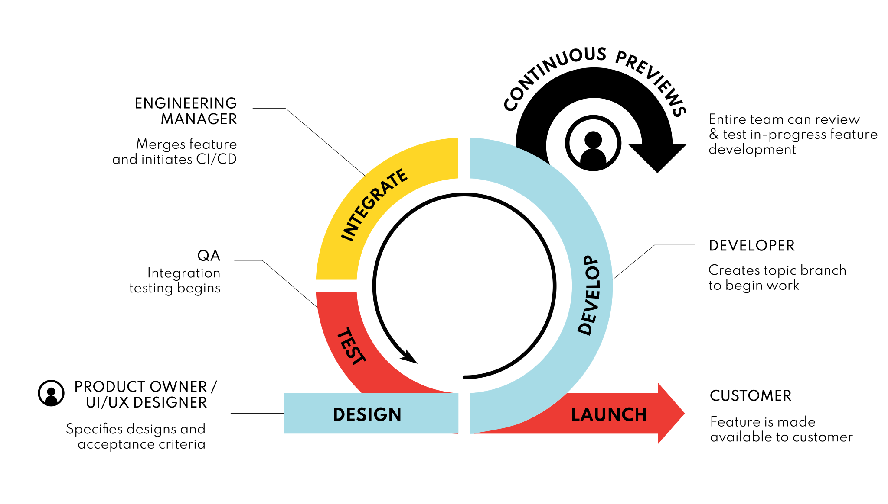

# Continuous Previews: A Best Practice for Agile Teams
Continuous Previews (CP) are an automation-enabled best practice that encourages cross-functional teams to continuously collaborate during the development process by providing feedback on features that are still in progress. With CP, git topic branches are previewed using on-demand test environments before they are merged into a downstream branch. 

CP helps solve both technical challenges and collaboration challenges.  From a technical standpoint CP makes it easy to test pre-merge versions of your complete application with all of its services while at the same time working to eliminate barriers to team collaboration - particularly in a primarily remote work environment.

This modern approach to agile enables teams to catch issues early, iterate quickly, and avoid the inefficiencies inherent in merging broken features or "dirty code".  The following diagram illustrates how CP improves the standard agile development process:

**CP is not a replacement for Continuous Integration / Continuous Delivery (CI/CD).  CP is designed to work in conjunction with CI/CD pipelines. You can think of CP as a preprocessing step that occurs before the merge, such that once you merge, your existing CI/CD pipeline takes over.**

## Previews vs. Standard Deployments

|            Previews                     | Standard Deployments        |
| --------------------------------------- | -------------------------- |
| Ephemeral / purpose-driven lifecycle    | Persistent / long-running  |
| Topic branches (features and bug fixes) | Production, Staging, QA    |
| Pre-merge                               | Post-merge                 |
| Preview URL                             | Static URL                 |

## Previews vs. Continuous Previews

|            Previews                     | Continuous Previews                        |
| --------------------------------------- | ------------------------------------------ |
| Initiated and deleted ad hoc (e.g. docker-compose up/down) | Initiated and deleted via event webhooks (open/close PR, new/updated image tags)             |
| Typically for individual developer / local testing | Intended for sharing with team for feedback and approval |
| |  Team-focused System for Previewing |

## Benefits of Continuous Previews

Teams incorporating Continuous Previews into their workflow often see the following benefits:

* **Catch issues earlier in the Development Cycle where they are easier to Find and Fix**
* **Improve Collaboration Across Dev and Product Teams to Iterate Faster**
* **Reduce how often Test/QA environment breaks; ability to resolve breakage more quickly**
* **Increase development velocity by reducing returned tickets**
* **Reduce costs by replacing your static QA environment with dynamic preview environments**
* **Eliminate the bottlenecks of shared Dev Environments - Deploy git branches without having to wait until they’re merged**
* **Merge with confidence knowing a feature works as intended**
* **Works with your existing CI/CD pipeline**

A common bottleneck for software development teams is tracing the root cause of bugs in QA/Test. When multiple developers are pushing commits to a shared development branch, it’s difficult to know if a problem originated as a result of the integration step or if there was a problem with the feature itself.

By testing the functionality of a topic branch before it’s merged into QA/Test, your team can be sure that any problems that occur after the merge are the result of an integration issue, not a functionality issue. That is, you can verify that a feature works as intended before it’s merged with everyone else’s code. 

 By deploying your feature(s) to a publicly accessible endpoint - like the shareable preview URLs that Uffizzi provides - your teammates can view your work and provide timely feedback that reduces the number of returned tickets and ultimately improves development velocity. 

Continuous Previews can lead not only to time savings, but also cost savings. Teams employing an Agile + Continuous Previews strategy can often replace their single, static QA/Test environment with a dynamic set of test environments for each new topic branch. These dynamic test environments can share the same lifecycle as the topic branch itself—i.e., when a branch is created or deleted, a corresponding environment is stood up or torn down. This enables you to effectively "rent" your QA environment(s) - there's no reason to run QA environments in off hours, over the weekend, or during holidays - you can run these for a fraction of the time and have as many environments as you need for as long as you need them and no longer.

To learn more see the [CP Manifesto](https://www.cpmanifesto.org).

