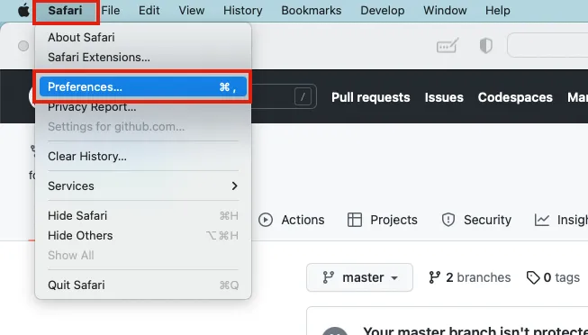
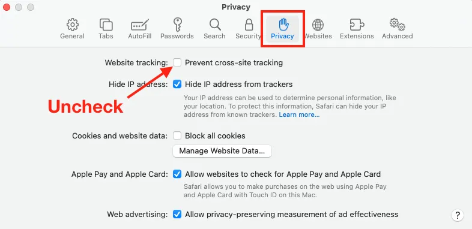

# **Demo on Uffizzi** button

Add the **Demo on Uffizzi** button to your repository's `README.md` to give visitors a fast way to interact with your application in a live demo environment. This button requires **no configuration** by your users, and it **does not** require them to have a Uffizzi account.

  
 
!!! Note
    The **Demo on Uffizzi** button is currently available only to Uffizzi [Open Source Plan](https://www.uffizzi.com/pricing) customers—i.e. it will not work on any arbitrary repo. Open source maintainers can [contact us on Slack](https://join.slack.com/t/uffizzi/shared_invite/zt-ffr4o3x0-J~0yVT6qgFV~wmGm19Ux9A) to configure this for their projects.

## How it works  

When you add the following markdown to your `README.md`, Uffizzi will check to see if your project has a demo configuration, as noted above. When visitors click on this link, Uffizzi uses the HTTP `referer` header to determine the origin of the request. If the request comes from your GitHub repository, the visitor will get a demo of your project, as defined by your demo configuration.

```
[](https://app.uffizzi.com/demo)
```
&nbsp;  
!!! Important
    **Browser Support**
    
    The **Demo on Uffizzi** button works in Chrome and Firefox browsers by default; however, Safari browsers are configured with a [stricter privacy policy by default](https://webkit.org/blog/9661/preventing-tracking-prevention-tracking/), so demos will not work for Safari users until they disable this restriction. To enable demos, go to **Safari** > **Preferences** > **Privacy**, then uncheck **Prevent cross-site tracking**.

&nbsp;  
  
  


