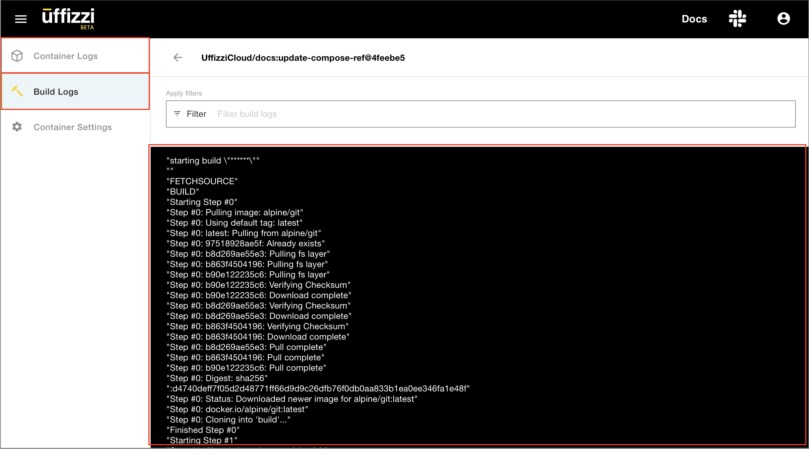
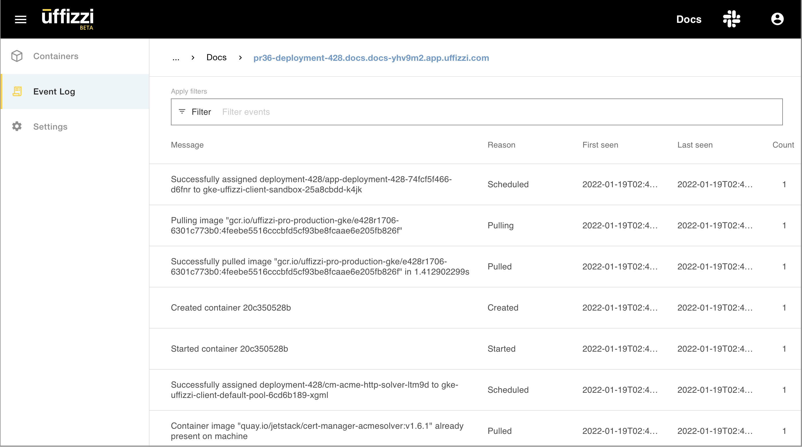

# Check logs  

Three types of logs are available in Uffizzi: container logs, build logs and event logs.

**Container logs** - Also known as runtime logs, container logs are output from the application itself, including its dependencies. Container logs capture stdout, allowing you to inspect the activity of your application. Anything you would typically see in a terminal running your app locally is shown here. If you have trouble getting your app running on Uffizzi or connecting to a database, container logs are often the best place to start troubleshooting.

**Build logs** - When building your application from source (e.g. GitHub), Uffizzi displays logs from this process in the the Build Logs feed. If you have trouble getting your app to build on Uffizzi, build logs may provide you with enough information to troubleshoot your issue.  

To view either container logs or build logs, first navigate to the desired preview in the Uffizzi Dashboard, then select the container whose logs you want to view. You can toggle between the container and build logs in the left-hand menu:  

  

&nbsp;  

**Event logs** - These are Kubernetes events that are provided by the Kubernetes API.  Uffizzi displays these logs in the Event Log feed. To view event logs, first navigate to the desired preview in the Uffizzi Dashboard, then select the **Event Log** option from the left-hand menu:  

