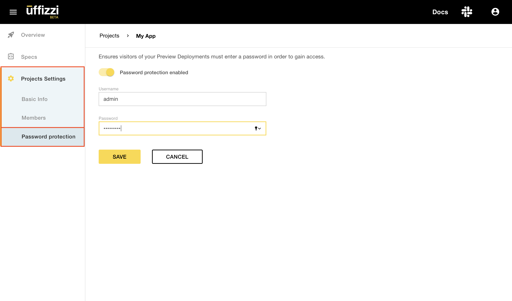

# Configure password-protected environments

Uffizzi allows you to configure a username and password for your test environments to limit who has access to them. This feature is enabled per project, so anyone navigating to the URL of any environment of that project, either via a web browser or with a command like `curl`, must enter valid credentials to gain access. To configure this feature, you must be an account Admin:

1. Navigate to your project, then select **Project Settings** > **Password protection** > **EDIT** > **Password protection** (toggle).  
2. Enter a username and password, then select **SAVE**.

Password protection will now be enabled for all environments belonging to this project, including any pre-existing environments.  

___

___  

!!! Warning
    If you enable password protection and are using the GitHub Actions [reusable workflow](https://github.com/UffizziCloud/preview-action/blob/6504e1578015e5470858bfe7e7793779fa01b6a4/.github/workflows/reusable.yaml), as described in the guide titled [Set up Uffizzi for your application](../set-up-uffizzi-for-your-application.md), you must pass `url-username` and `url-password` as parameters to the reusable workflow, otherwise the deployment confirmation step will fail. You can find an example GitHub Actions job [here](https://github.com/UffizziCloud/example-voting-app/blob/8f78f9204c8869aca538cb929d49c5b1074da8ff/.github/workflows/uffizzi-previews.yml#L179-L180).

## Suggested articles
* [Set up single sign-on (SSO)](single-sign-on.md)
* [Configure role-based access (RBAC)](rbac.md)
* [Check the logs](logs.md)
