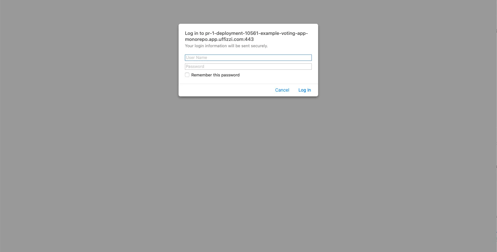

# Password-protected environments

Uffizzi allows you to configure a username and password for your Preview Environments to limit who has access to them. This feature is enabled per project, so anyone navigating to the URL of any Preview Environment of that project, either via a web browser or with a command like `curl`, must enter valid credentials to gain access. To configure this feature, you must be an account [Owner](../guides/rbac.md#owner).

Select your CI provider to begin set up:    

[Uffizzi CI ⬇](#configure-password-protection-for-uffizzi-ci)    
[GitHub Actions ⬇](#configure-password-protection-for-github-actions)  

## Configure password protection for Uffizzi CI  
1. In the Uffizzi Dashboard, navigate to your project, then select **Project Settings** > **Password protection** > **Edit** > **Enabled** (toggle).
  <details><summary>Click to expand</summary>
  
  </details>
2. Enter a username and password, then select **Save**.  

Password protection will now be enabled for all environments belonging to this project, including any pre-existing environments. To access these Preview Environments, you can pass your credentials via the [web browser](#access-via-web-browser) or [`curl` command](#access-via-curl).  

## Configure password protection for GitHub Actions
1. In the Uffizzi Dashboard, navigate to your project, then select **Project Settings** > **Password protection** > **Edit** > **Enabled** (toggle).
  <details><summary>Click to expand</summary>
  
  </details>
2. Enter a username and password, then select **Save**.
3. Store credentials as GitHub Actions secrets.  
  &nbsp;  
  In GitHub, navigate to your repository. Then select **Settings** > **Secrets and variables** > **Actions** >  **Secrets** (tab) > **New repository secret**. (_Be sure you add a new repository **secret** from the **Secrets** tab, not a new repository **variable** from the **Variables** tab_). Add a secret name and value, then select **Add secret**.       
  <details><summary>Click to expand</summary>
  
  
  </details>
4. Pass credentials as parameters in your preview job.  
  &nbsp;  
  If you are using the official Uffizzi [preview action](https://github.com/marketplace/actions/preview-environments) with the [reusable workflow](https://github.com/UffizziCloud/preview-action/blob/master/.github/workflows/reusable.yaml), you will also need to pass the environment username and password to the reusable workflow via [`url-username`](https://github.com/marketplace/actions/preview-environments#url-username-and-url-password) and [`url-password`](https://github.com/marketplace/actions/preview-environments#url-username-and-url-password) parameters. These credentials are used by the preview action (and Uffizzi) to perform health checks on your Preview Environments. You can see example usage [here](https://github.com/UffizziCloud/example-voting-app/blob/8f78f9204c8869aca538cb929d49c5b1074da8ff/.github/workflows/uffizzi-previews.yml#L179-L180).
  &nbsp;  
  ``` yaml hl_lines="9 10" title="uffizzi-preview.yaml"
  deploy-uffizzi-preview:
    name: Use Remote Workflow to Preview on Uffizzi
    needs: render-compose-file
    uses: UffizziCloud/preview-action/.github/workflows/reusable.yaml@v2.2.0
    if: ${{ github.event_name == 'pull_request' && github.event.action != 'closed' }}
    with:
      ...
    secrets:
      url-username: ${{ secrets.URL_USERNAME }}
      url-password: ${{ secrets.URL_PASSWORD }}
    permissions:
      ...
  ```

Password protection will now be enabled for all environments belonging to this project, including any pre-existing environments. To access these Preview Environments, you can pass your credentials via the [web browser](#access-via-web-browser) or [`curl` command](#access-via-curl).  

## Access via web browser
If you visit the preview URL in a browser, you can enter the environment username and password in the _http_ dialog window, as shown in the screenshot below. Select **Log in** to be redirected to the Preview Environment.  


## Access via `curl`
You can access a password-protected environment via the `curl` command by passing the environment username and password as an argument. For example:    

```
curl -u "username:password" [PREVIEW_URL]
```

!!! Note
    The official Uffizzi [preview action](https://github.com/marketplace/actions/preview-environments) uses the `curl` command to check for successful deployments of Preview Environments. You can see how the Uffizzi preview action performs this check [here](https://github.com/UffizziCloud/preview-action/blob/599ea1a94a5ee8bca85843f9ec40524778e14cfc/.github/workflows/reusable.yaml#L284-L287).

## Suggested articles
* [Set up single sign-on (SSO)](single-sign-on.md)
* [Configure role-based access (RBAC)](rbac.md)
* [Check the logs](logs.md)
