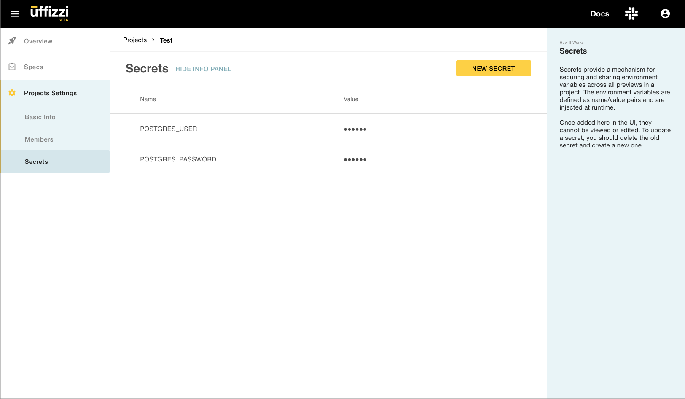

# Add secrets  

Secrets provide a mechanism for securely adding sensitive data, such as passwords, tokens, or keys, to the containers of a Preview deployment. Secrets are similar to environment variables, but they are intended for confidential data. Secrets are defined as name/value pairs and are injected at runtime. 

Secrets can be added in the Uffizzi Dashboard (**Project** > **Project Settings** > **Secrets**). Once added, they cannot be viewed or edited. To update a secret, you should delete the old secret and create a new one. Secrets added in the **Project Settings** are available to all Preview environments in that project.  
&nbsp;  

