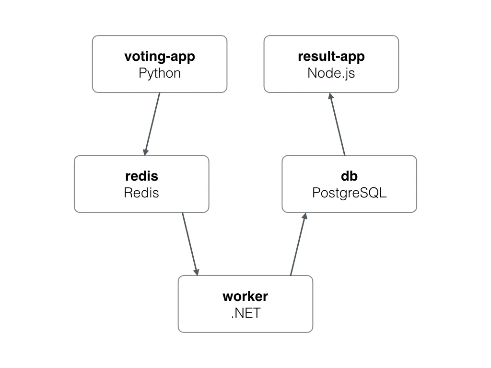
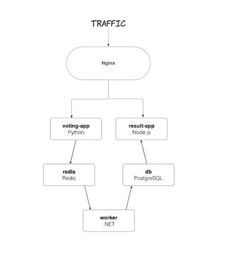

# Support microservices in ephemeral environments with Nginx

**A guide on how you can support your microservices architecture on Uffizzi ephemeral environments through Nginx**  

By [Shruti Chaturvedi](https://github.com/ShrutiC-git) 

## **Nginx with Uffizzi: What problems can it solve?**  

Uffizzi, being cloud-native, allows you to bring your microservices architecture into ephemeral environments. The services directive is used to start each of the microservices defined in the `docker-compose.uffizzi.yml` file in its own container. This allows you to develop and manage the microservices as containers, independently of each other, in your ephemeral environments independently of each other.  

The next component of the microservices architecture is networking. How you configure networking for your ephemeral environments depends on your application architecture. If you have multiple independent client-side and server-side services talking through HTTP/S, for example, an Angular frontend talking to Node backend, networking between these services can be achieved using Nginx as a reverse proxy. Some other cases where we’ve used Nginx to help projects onboard to ephemeral environments are:  

- More than one microservice exposed publicly: if your application has multiple public-facing services, you’ll need to put them behind Nginx (or an alternate reverse proxy such as Traefik). The reverse proxy will receive your traffic, and route requests for different services accordingly. Currently, Uffizzi does not support adding multiple "ingresses" (multiple entry ports) into your application. For example, if you have one service named personal-account, exposed publicly on port `3000`, and another service named team-account, exposed publicly on port `3001`, natively (without Nginx), you can expose either `3000` or `3001` on your ephemeral environment to receive external requests using the [ingress field in your compose file](../references/compose-spec/#ingress-required). With Nginx added, you can put both services behind Nginx, expose Nginx to receive HTTP/S traffic, and forward requests coming to Nginx to your services.   

- More than one port needs to be accessed publicly (primarily applicable for monoliths): if a service has more than one exposed port that needs to be accessed publicly, adding Nginx as a reverse proxy will help you achieve this elegantly.  

## **Example Application**
Let’s take a look at an example of configuring a microservices application with Nginx. This example is a simple voting app, where users can cast a vote for dogs or cats and see the results of the polling in real-time. You can follow the [example on GitHub](https://github.com/UffizziCloud/quickstart). The application has 5 different microservices:  

1. **`voting-app` service**: client-side service in Python, that allows you to cast a vote. Writes to our Redis queue  

2. **`redis` service** - Redis queue to collect new votes  

3. **`worker` service** - .NET Core worker service to consume votes from the Redis queue and write to Postgres  

4. **`db` service** - Postgres DB, backed by a Docker volume, to write and read the votes  

5. **`result-app`** service - Node.js web app that reads data from the db service and displays the results in real-time.  

  

In this example, we have two services exposed publicly: the `voting-app` service, which receives votes, and the `result-app` service, which displays the results back to the user. As mentioned before, currently, Uffizzi supports defining a single service in your ephemeral environment to receive external requests. However, adding Nginx into the environment will solve the problem. 

We will define Nginx as the ingress into the ephemeral environments to listen to incoming HTTP/S connections and route the request to one of the two exposed services based on the path requested. 

  

To define an [`ingress`](../references/compose-spec.md#ingress-required), we need a `port` (the environment will be listening for traffic on this port) and a `service` (the requests coming to the port will be forwarded to this service). In our case, we will first create an `nginx` service in the compose file, and use this service as our `ingress`. 

### **Step 1: Creating an Nginx container**  

Within your `docker-compose.uffizzi.yml` file, add a new service (within the services directive), we’ll name it `nginx`. Our `nginx` service will use the [official Nginx image from Docker Hub](https://hub.docker.com/_/nginx). If you want, you can also build a custom image based on Nginx’s official image. If you’re following the example on GitHub, please know that we have used a custom image for the nginx service (named `loadbalancer`) built on the official Nginx image.

``` yaml
  nginx:
    image: nginx:alpine
    deploy:
      resources:
        limits:
          memory: 125M
```  

### **Step 2: Creating Nginx configuration file**  

Once you have the above service added, we will now configure routing rules for Nginx to forward requests to the `voting-app` service and `result-app` service. 

We will create a new configuration file called `nginx.conf` and define how Nginx should handle request routing. Please make sure this file is placed under a directory, and the total size of the directory is smaller than 1 MB compressed (the limit is not applicable if you’re using [Uffizzi CI](../references/uffizzi-ci.md)). If you’re having trouble configuring volumes, read our [troubleshooting guide](../troubleshooting/most-common-problems.md).  

There are 2 ways traffic will come into the example app:  

1. Users interact with the voting-app service to cast their votes   
2. Users interact with the result-app to see results  

We will, therefore, need to route requests from the `nginx` service to these two services. Our requirements for the `nginx` (`ingress`) service  are:  

- Requests to the root of our app should take users to the `result-app` service, where they can see the votes that have been cast so far.   

- The `result-app` service should redirect users to the `vote-app` service, where they can cast their votes.  

- The `vote-app` service must respond to the redirect from `result-app` and allow users to cast their votes. 

Here is the `nginx.conf` file:

```
server {
    listen       8080;
    server_name  localhost;
    location / {
        proxy_pass      http://localhost:8088/; # result-app addr
    }
    location /vote/ {
        proxy_pass      http://localhost:8888/; # voting-app addr
    }
}
```

In the above `nginx.conf` file, we have defined Nginx to listen on port `8080`. The port you define here should not be in use by other services/containers. Requests received at the root (defined by `/`) will be sent from Nginx to the `result-app` service. Requests received at `/vote` will be sent to the `vote-app` service. This config file will allow the `nginx` container—when configured as `ingress` in the `docker-compose.uffizzi.yml`—to receive HTTPS traffic and forward HTTP to the defined upstream.  

### **Step 3: Configuring the Nginx container**  

We’ll now further configure the Nginx container to mount this config file into the container. Make the following changes to the `nginx` service:

``` yaml
 nginx:
   image: nginx:alpine
   environment:
     VOTE_HOST: "localhost"
     VOTE_PORT: "8888"
     RESULT_HOST: "localhost"
     RESULT_PORT: "8088"
   volumes: ./nginx-uffizzi:/etc/nginx
   deploy:
     resources:
       limits:
         memory: 125M
```

Take note of the `volumes` section. Currently, Uffizzi does not support mounting single files from the host to the container. We, therefore, placed the `nginx.conf` file into a directory called `nginx-uffizzi` and mount this directory to `/etc/nginx` in the container.   

According to the official docs from Nginx, for NGINX Open Source, where the config needs to be mounted will depend on the package system used to install NGINX and the operating system. It is typically one of `/usr/local/nginx/conf`, `/etc/nginx`, or `/usr/local/etc/nginx`. The `nginx.conf` is a highly configurable file that you can configure according to the needs of your app. However, instead of replacing the default `nginx.conf` altogether, we often recommend adding your configuration file(s) in the `/etc/nginx/conf.d/` directory, which Nginx will apply as additional configuration to the default `nginx.conf`. See [Nginx documentation](https://docs.nginx.com/nginx/admin-guide/basic-functionality/managing-configuration-files/) for details on how multiple configurations are applied.

### **Step 4: Adding nginx container as our entrypoint/ingress into the ephemeral environment**  

After fully configuring the nginx container, let’s add this as the ingress to receive traffic into Uffizzi ephemeral environments. At the top-level of your compose file, add the following:  

``` yaml
x-uffizzi:
 ingress:
   service: nginx
   port: 8080
```

Your compose should look like this after adding the above snippet:  

``` yaml
x-uffizzi:
 ingress:
   service: nginx
   port: 8080
services:
 nginx:
   image: nginx:alpine
   volumes: ./nginx-uffizzi:/etc/nginx
   deploy:
     resources:
       limits:
         memory: 125M
 other-services:
   image: service-image
```

Voila! After making these changes, and opening a PR in your project, a new environment will spin up, receiving HTTPS traffic on the port you have defined (here `8080`). Adding a reverse proxy as ingress for your ephemeral environments is a really powerful way of bringing your microservices application to Uffizzi. Scenarios we discussed above, and more, can efficiently be solved by adding Nginx into your Uffizzi ephemeral environments. For more blogs on enhancing developer productivity with ephemeral environments, check out [our blog](https://www.uffizzi.com/blog). If you want ephemeral environments for your microservices, [get in touch with us](https://www.uffizzi.com/contact) and let us know how we can help!