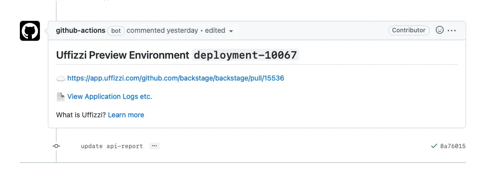

# Uffizzi Overview

## What is Uffizzi?
Uffizzi is a platform that enables teams to easily create and destroy on-demand cloud environments for development, QA, staging, and more. These "ephemeral environments" give teams a flexible way to scale their test infrastructure, while avoiding the bottleneck of a traditional shared test environment. With Uffizzi ephemeral environments, developers can test pre-release branches in clean, isolated environments that are not polluted by previous tests. Uffizzi ephemeral environments can also be used by product and sales teams to preview new features for clients and other stakeholders.  

## How it works

When added to your git repository or continuous integration (CI) pipeline, Uffizzi works in the background each time a change is made to your code (typically often when a pull request is opened, closed, or updated). Additionally, you can create environments via the Uffizzi CLI, or by manually triggering a CI workflow.  

Uffizzi will post a comment to your pull request issue with a secure _https_ link to your ephemeral environment. This environment is continually refreshed when you push new commits, so anyone reviewing the environment will see the latest changes to the branch. Uffizzi also handles clean up, so your environments last only as long as you need them.

## Configuration
To configure Uffizzi environments for your project, you'll need two things:  

1. **A configuration file** that describes your application or service. Depending on the type of environment you want to create, this will be a Kubernetes manifest YAML or [`docker-compose.uffizzi.yaml`](references/compose-spec.md).  
2. **CI platform (optional, but recommended)** - A service that builds each new commit, such as GitHub Actions, GitLab CI, or [Uffizzi CI](references/uffizzi-ci.md). 

!!! Note 
    **What is Uffizzi CI?** Uffizzi CI is an integrated build service provided by Uffizzi Cloud. Every time you push a new commit to your repository, Uffizzi CI receives a webhook and builds your application from source. Choose this solution if you don't already have a CI platform or don't want to use your existing solution to build preview images. [Learn more >](references/uffizzi-ci.md)

## Getting Started
Uffizzi can be use via its CLI, but it is primarily designed to work as a step in your CI pipeline, after images are built and pushed to a container registry. As noted above, you can use Uffizzi's integrated CI service ([Uffizzi CI](references/uffizzi-ci.md)) if you don't have an existing solution. 

Choose a guide below based on your CI provider of choice.  
&nbsp;  
[&nbsp; &nbsp; Quickstart for Uffizzi CI &nbsp; &nbsp;](quickstart-uffizzi-ci.md){ .md-button .md-button--primary }&nbsp; &nbsp;
[Quickstart for GitHub Actions](quickstart-gha.md){ .md-button }
&nbsp;  
&nbsp;  
&nbsp;  
&nbsp;  
&nbsp;  
&nbsp;  

